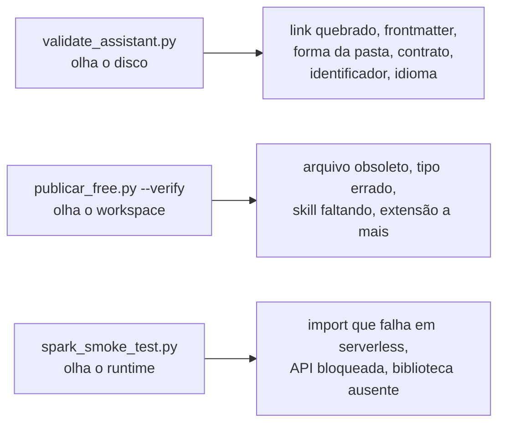

# `tools/` — as ferramentas que sustentam os portões

Seis scripts Python, sem dependência externa além do que a máquina já tem. Eles
são o que transforma as regras deste repositório em algo que **reprova**, em vez
de algo que se pede que alguém lembre.

> **Esta pasta não é publicada.** Nada aqui vai para o workspace do Databricks —
> nem no Free, nem no trabalho. Quem recebe o `.assistant/` copiado **não tem**
> estes scripts, e por isso nenhum documento do produto deve mandar rodá-los.
> Eles rodam aqui, no repositório, antes de a cópia sair.

## O que cada um faz

| Script | Linhas | Papel | Roda quando |
|---|---|---|---|
| `validate_assistant.py` | 1048 | 20 checks estruturais sobre `ambiente_fonte/` | **sempre**, antes de qualquer commit |
| `render_simulado.py` | 105 | regenera `Novo_Ambiente_Simulado/` a partir da fonte | depois de editar a fonte |
| `publicar_free.py` | 346 | publica no Databricks Free e confere o remoto | ao levar mudança para o laboratório |
| `spark_smoke_test.py` | 305 | executa os helpers no runtime real como job | ao mexer em helper que toca Spark ou ML |
| `api_publica.py` | 117 | extrai por AST a API pública de um módulo e gera o `__init__.py` | ao criar ou renomear objeto |
| `notebook_marker.py` | 57 | decide se um `.py` é módulo ou notebook Databricks | importado pelos outros, não chamado à mão |

Os dois últimos são **bibliotecas**, não comandos: existem para que os quatro
primeiros concordem sobre o que é API pública e sobre o que é notebook. Duas
respostas diferentes para essas perguntas quebrariam o import no workspace sem
erro visível.

## Os três comandos do dia a dia

```powershell
python tools/validate_assistant.py          # ~2 s   · exit 0 obriga
python tools/render_simulado.py --write     # < 5 s  · sem --write, só relata
python tools/publicar_free.py --verify      # ~1m40s · read-only, exige CLI autenticada
```

E os dois que custam mais, usados de propósito e não por hábito:

```powershell
python tools/publicar_free.py --execute              # gate consciente: escreve no workspace
python tools/validate_assistant.py --conferir-readme # ~1m40s: reexecuta os comandos do README
```

Saída real de uma execução limpa, com o caminho substituído por placeholder:

```text
raiz analisada     : <repo>/ambiente_fonte
skills             : 13 · 2/13 com as 5 seções do template
helpers citados    : 72 caminhos verificados
idioma da docstring: 60 módulos, 0 com docstring em inglês
pastas de objeto   : 60 conferidas (nome, arquivos, __init__)

APROVADO: 0 falha(s), 11 aviso(s)
```

**As contagens mudam conforme o repositório cresce.** Não as decore: o número
certo é o que o comando devolve hoje. Foi por decorar número que este projeto
publicou "12 skills" durante três sprints em que já eram 13.

## O que cada portão pega — e o que ele não pega



Os três pegam classes **disjuntas**, e isso não é teoria: na Sprint 5 o validador
achou 16 links quebrados, o `--verify` achou 16 arquivos órfãos no workspace, e a
execução achou um `countDistinct` que não resolve — tudo no mesmo commit.

Nenhum dos três pega **contradição entre dois documentos publicados**. Cada um
compara o repositório contra a realidade; nenhum compara duas afirmações entre
si. Isso continua sendo trabalho de auditoria humana ou de outra IA.

## Como acrescentar um check

1. Escreva a função em `validate_assistant.py` com um docstring que diga **qual
   defeito real** a originou — todos os checks de lá têm, e é o que permite
   calibrá-los depois sem adivinhar a intenção.
2. Registre a chamada no `main()` e acrescente a linha de contagem no resumo.
3. **Construa o caso que ela deve pegar e prove que pega.** Uma guarda escrita
   sem esse passo já foi aceita neste repositório e aprovava 82% dos casos que
   deveria reprovar.
4. Escolha entre `warnings` e `problems`: aviso é para dívida aberta com prazo;
   falha é para norma que já se cumpre. Deixar em aviso o que já está limpo é
   convidar a regressão.

## Fontes

- Regras que estes scripts fazem cumprir: `.claude/rules/`
- Ordem em que rodam: [ciclo de vida](../docs/playbooks/ciclo-de-vida.md)
- Por que a publicação é própria, e não do engine do Hub:
  [ADR-0005](../docs/decisions/ADR-0005-publicacao-propria-no-free.md)
- O que a conferência verifica, e por que o número mora no código:
  [ADR-0008](../docs/decisions/ADR-0008-criterios-de-conferencia-da-publicacao.md)
- Skills que embrulham estes comandos: `.claude/skills/`
