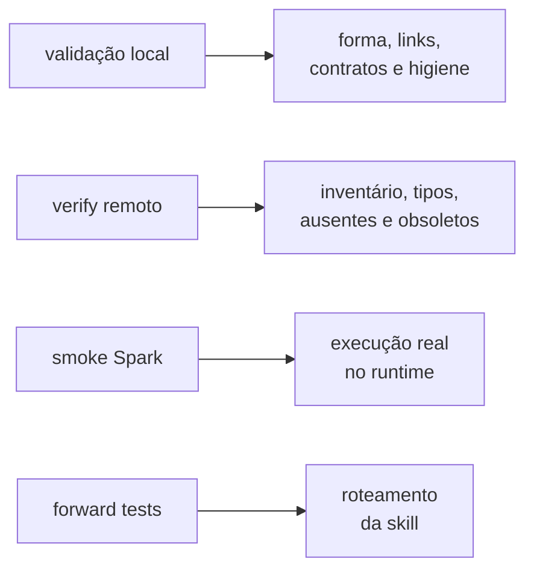

# `tools/` — gates e automação do repositório

> **MANUTENÇÃO · NÃO PUBLICADO.** Estes arquivos rodam na máquina que mantém o
> Git. O usuário do `.assistant` no Databricks não recebe esta pasta.

As ferramentas convertem regras editoriais e arquiteturais em verificações que
podem reprovar uma mudança.

## Escolher a ferramenta

O [catálogo de manutenção](CATALOGO.md) separa gates atuais, bibliotecas de apoio,
probes que exigem ambiente autorizado e rotas históricas. Comece por ele ao levar
o clone ao trabalho. Os [workflows](../.github/workflows/README.md) documentam quais
comandos o GitHub executa e seus efeitos. Ferramenta presente não concede execução
remota, instalação, publicação, exclusão ou homologação.

## Comandos por objetivo

| Objetivo | Comando |
|---|---|
| validar fonte e repositório | `python tools/validate_assistant.py` |
| conferir somente saídas locais do README | `python tools/validate_assistant.py --conferir-readme` |
| regenerar o derivado | `python tools/render_simulado.py --write` |
| conferir saída ignorada por paths/bytes/tipos | `python tools/render_simulado.py --check` |
| conferir recuperação do protótipo retirado | `python tools/verify_concierge_history.py` |
| conferir DAG e checks de CI | `python tools/ci_workflows.py --check` |
| gerar/validar recursos visuais vigentes | [rota de produção v2](readme_visuals/README.md#produção-v2--caminho-recomendado) |
| publicar no Free | `python tools/publicar_free.py --execute --profile <free> --expected-host <url-free>` |
| conferir o remoto (inventário e tipos) | `python tools/publicar_free.py --verify --profile <free> --expected-host <url-free>` |
| conferir o remoto **por conteúdo** | `python tools/publicar_free.py --verify --conteudo --profile <free> --expected-host <url-free>` |
| executar smoke no Databricks | importar/submeter `tools/spark_smoke_test.py` |
| criar pacote de auditoria | `python tools/bundle_para_auditoria.py --mode canonical` |
| preparar contexto de uma tarefa | [recortes explícitos e expansão](../docs/ai/task-context.md) |
| diagnosticar compatibilidade MM01 v1 congelada | `python -B tools/mm01_local_certify.py --diagnose` |
| conferir identidade/coleta B0 | `python -B -m tools.skill_enforcement.parallel.coverage` |
| criar ZIP de implantação | `python tools/bundle_implantacao.py` |

## Pré-requisitos e efeitos

Execute da raiz do checkout completo, com Python e Node/pnpm compatíveis com os arquivos de dependências e lockfile. Prepare Python com `python -m pip install -r tools/requirements-dev.txt -r tools/requirements-temas-dev.txt`; a instalação altera o ambiente escolhido. Prepare Node conforme o [guia visual](readme_visuals/README.md). `ci_local.py` verifica pré-requisitos globais mesmo com `--etapa`.

- Validador e `--conferir-readme` leem localmente; exit 0 indica os checks cobertos, não runtime Databricks.
- Render sem flag mostra plano. `--write` remove e recria `.artifacts/simulado/`; inventarie extras e trabalhe isoladamente antes. Prepare essa saída explicitamente antes dos testes num checkout novo. `--check` confere inventário/bytes/tipos sem depender de Git. Consulte [saída gerada e CI vigente](../docs/manutencao/saida-gerada.md).
- Testes podem gravar temporários locais. `ci_local.py --verbose` executa a enumeração `ETAPAS`; etapa isolada não aprova o agregado.
- Publicação exige autorização própria. `--execute` escreve remotamente; verify lê e `--conteudo` compara bytes. Falha parcial exige conferir recibo e estado antes de repetir.
- Erro de dependência é bloqueio de ambiente; erro de contrato exige correção da fonte, nunca relaxamento do teste.

## Ciclo mínimo

```powershell
python tools/validate_assistant.py
python tools/render_simulado.py --write
python tools/publicar_free.py --execute --profile <free> --expected-host <url-free>
python tools/publicar_free.py --verify --conteudo --profile <free> --expected-host <url-free>
```

`--execute` altera o workspace e recusa espelho desatualizado antes de escrever.
`--verify` é leitura. Sem `--conteudo` ele compara inventário e tipos: um módulo
com o mesmo nome e o mesmo tipo, porém conteúdo diferente, passaria. Com
`--conteudo` cada objeto é exportado e comparado byte a byte na representação
canônica — só então é possível afirmar equivalência entre local e remoto. A
saída declara o alcance da comparação em toda rodada. Publicar sem verificar não
fecha o gate.

A normalização da comparação é mínima e declarada: fim de linha, e fim de arquivo
apenas em notebook. Comentário, espaço e linha em branco **não** são removidos —
fazê-lo mascararia diferença real. Por isso a saída registra dois hashes: o bruto,
que identifica os bytes do pacote, e o normalizado, que é o único comparável com
o remoto.

## Inventário

| Arquivo | Responsabilidade |
|---|---|
| `readme_objeto_contract.py` | estrutura, links e dispensa monotônica dos READMEs de objeto |
| `validate_assistant.py` | estrutura, YAML, links, Python, contratos, identidade e consistência |
| `render_simulado.py` | recriar o espelho de workspace a partir da fonte |
| `render_readme_visuals.mjs` | renderer histórico v1; recusa manifesto v2; não usar no pacote vigente |
| `publicar_free.py` | plano, publicação protegida e conferência remota |
| `spark_smoke_test.py` | chamadas funcionais no runtime Databricks |
| `api_publica.py` | extrair API pública por AST e gerar `__init__.py` |
| `notebook_marker.py` | distinguir módulo Python de notebook Databricks |
| `project_policy.py` | centralizar identidade neutra, skills e diretórios gerenciados |
| `tests/test_concierge_integracao.py` | conferir integração do Concierge, referências e igualdade fonte/espelho |
| `bundle_para_auditoria.py` | corpus canônico, de segurança, completo ou recorte explícito de tarefa |
| `bundle_implantacao.py` | ZIP mínimo sanitizado com manifesto SHA-256 |

Os módulos de apoio centralizam os contratos usados por render, publicação e
validação. O owner de cada definição está no código correspondente, não numa
contagem copiada neste índice.

## O que cada gate prova



Nenhum gate substitui o outro:

| Gate | Não prova |
|---|---|
| validação local | execução em Spark ou comportamento conversacional |
| verify remoto | correção do código |
| smoke | ACLs, políticas e runtime do trabalho |
| forward test | qualidade da resposta ou resultado numérico |

## Pacotes de auditoria e implantação

`bundle_para_auditoria.py`:

- `canonical` (padrão): corpus textual versionado, incluindo governança e história;
  omite o espelho legado e a referência congelada já excluída pelo gerador;
- `security`: preserva a seleção canônica e acrescenta manifesto SHA-256 de todos
  os caminhos versionados, inclusive os omitidos do corpo;
- `full`: inclui todas as camadas textuais versionadas; `--incluir-espelho` conserva
  seu alias de compatibilidade para esse modo;
- `task`: recorte opt-in identificado como contexto parcial, com tarefa explícita,
  caminhos/motivos, hashes, exclusões e rota de expansão. Consulte o
  [contrato do recorte](../docs/ai/task-context.md). Não substitui auditoria integral.

Arquivar um documento não o exclui de `canonical` ou `full`. Os bytes e arquivos
incluídos são medidas de conteúdo, sem conversão presumida para tokens. Um bundle
lê dados locais e grava a saída solicitada; não publica nem concede acesso.

`bundle_implantacao.py` leva apenas o produto sanitizado e o manifesto. Por
padrão, ambos recusam worktree sujo para não atribuir conteúdo novo ao commit
anterior.

`.artifacts/` é saída local e não fonte de verdade. Um ZIP citado em relatório
datado representa aquele commit; não existe alias “latest”. Para implantar,
gere o bundle novamente em HEAD limpo e confira `source_commit` e os hashes do
`MANIFEST.json`.

## Acrescentar uma verificação

1. Registre no docstring qual defeito real a guarda previne.
2. Construa um mutante que viole a propriedade.
3. Prove que o mutante reprova e que o caso válido passa.
4. Exponha contagem ou evidência que revele varredura vazia.
5. Atualize teste e documentação; registre a sessão em evidência datada ou handoff.
   Leve ao `CHANGELOG.md` apenas marcos de capacidade, contrato, arquitetura ou risco.

Uma contagem não substitui identidade exata, e “alguma exceção” não substitui a
assinatura esperada do erro.

## Onde continuar

- [Ciclo de vida](../docs/playbooks/ciclo-de-vida.md)
- [Testes e evidências](../docs/testes/README.md)
- [Decisões arquiteturais](../docs/decisions/README.md)
- [Skills operacionais](../.agents/skills/README.md)

## Escopos e evidência após a revisão

`repo_inventory.py` usa caminhos do índice Git para contagens reproduzíveis e
examina extras separadamente. Sem Git, a certificação reprova; um ZIP exportado
não deve ser apresentado como checkout validado. O validador lê o conteúdo atual
na worktree, portanto não certifica sozinho que ela está limpa.

`--conferir-readme` é local. `--conferir-readme-remoto` é opt-in, exige acesso ao
Databricks e confere somente o bloco remoto. Nenhum substitui o verify por conteúdo.

`publicar_free.py --verify --conteudo --relatorio .artifacts/verify.json` grava
origem, hashes completos por arquivo e resultado da comparação. O bundle e o
publicador recusam espelho antigo e extras/caches no pacote. Os hashes agregados
da comparação não são hashes do ZIP. A integração real ainda exige teste Free.

## READMEs de objeto — contrato vigente 1.0.0

`python tools/ci_local.py --etapa readmes` executa regressões próprias da nova
guarda e as regressões de convivência com o Concierge. A etapa descobre os
arquivos `tests/test_readme*.py`. A composição atual do gate e os nomes aceitos
por `--etapa` pertencem a [`ci_local.py::ETAPAS`](ci_local.py), também expostos por
`python tools/ci_local.py --help`. O contrato editorial vem do template do produto;
não há lista concorrente de títulos dentro da ferramenta.

[CONTROLE_MIGRACAO.json](../docs/sprints/readmes_objetos/CONTROLE_MIGRACAO.json)
registra o fechamento da transição e as identidades migradas. Ele permanece como
evidência e guarda de ratchet,
não como fila ativa de legados. Novos objetos sem README reprovam e reintroduzir
uma dispensa também deve reprovar. Histórico raso continua incompatível com a
verificação monotônica e exige `fetch-depth: 0`.

Essas verificações não importam helpers nem executam código Markdown. Não provam
clareza, estatística, veracidade de links externos ou compatibilidade de runtime.
Use o [checklist editorial](../ambiente_databricks/.assistant/hub_padroes/readme/checklist_objeto.md)
e registre quem fez a revisão. Código que executa não é sinônimo de análise correta.

## Composição READMEs + Concierge — R02-I

A composição R02-I preservou os controles de README e Concierge. A lista vigente
pertence a [`ci_local.py::ETAPAS`](ci_local.py); a composição histórica está na
evidência abaixo. `--etapa` aceita um nome para diagnóstico isolado; isso não
equivale à aprovação do conjunto.

`tests/test_readme_integracao.py` protege contra perda das etapas, colisão de
números ADR e inconsistência das rotas/documentos ao combinar as iniciativas.
Inclui testes negativos; não executa helpers ou conversas. Os testes originais
da R01 e do Concierge foram preservados. As evidências datadas da composição
ficam em [INTEGRACAO_R02.md](../docs/sprints/readmes_objetos/INTEGRACAO_R02.md).
## Diagnóstico visual V00

`inventario_visual.py` e `executar_baseline_visual.py` produzem evidência somente em `.artifacts/`. Consulte o [guia da V00](../docs/sprints/sistema_temas/V00.md) antes de executar. Não publicam nem alteram o produto.

## Contrato V01 aceito — verificador de manutenção

A [V01 do Sistema de Temas](../docs/sprints/sistema_temas/V01/README.md) especifica
aparência, não instala temas. `temas_v01_contract.py` verifica schema, exemplos,
metadados, links e integridade; não consulta dados, resolve tema em runtime ou
concede papéis. A referência dos tokens é gerada pelo próprio verificador.

No ambiente de manutenção autorizado, instale **ambos** os arquivos de dependências:

```powershell
python -m pip install -r tools/requirements-dev.txt -r tools/requirements-temas-dev.txt
python -B tools/temas_v01_contract.py
python -B -m unittest discover -s tools/tests -p "test_temas_v01*.py" -v
```

Os procedimentos completos, inclusive diagnóstico e retorno, estão no
[guia do mantenedor](../docs/sprints/sistema_temas/V01/GUIA_MANTENEDOR.md).
`.github/workflows/temas-v01-ci.yml` executa essas verificações com leitura apenas.
Não substitui nem reduz o gate `ci_local.py` ou o CI permanente V00.
A composição atual é a lista [`ETAPAS`](ci_local.py), exposta por
`python tools/ci_local.py --help`; contagens datadas permanecem na evidência da campanha.
As verificações editoriais Node e a homologação Databricks continuam separadas.


## Núcleo V02 e promoção do schema

`python -B tools/temas_v02_check.py` confere fonte única, cópias derivadas,
fachada, catálogo e descoberta não vazia. `python -B tools/tests/test_temas_v02.py`
exercita entradas hostis, resolução e isolamento. A etapa `temas` descobre as regressões `test_temas*.py`; as demais etapas
permanecem na enumeração executável.
As dependências de validação estão em `requirements-temas-dev.txt`.

O verificador V01 passa a consumir o schema do padrão do produto e as funções
do núcleo. Os relatos anteriores não são reclassificados como execução de V02.
Estado e procedimentos: [V02](../docs/sprints/sistema_temas/V02/README.md).

## Controles de instruções de IA

`python tools/ai_controls.py --check` confere núcleo, rotas, claims, adaptadores e paridade sem escrever ou usar rede.
`--check --release` exige revisão oficial recente; não certifica sessões nativas.
`--check --migration-freeze` confere os bytes congelados exclusivamente para a campanha de 06/10/2026.
`--generate` atualiza somente adaptadores geridos e recusa cópia editada ou arquivo alheio.
Fontes: [guia](../docs/ai/README.md), [padrões](../docs/ai/standards/README.md).

## Identidade e descoberta B0

O inventário `python -B -m tools.skill_enforcement.parallel.coverage` confronta
os IDs de `ci_local.py::ETAPAS` e do perfil SE08 com o
[registro vivo de cobertura](skill_enforcement/parallel/coverage_registry.json).
A revisão 4 do contrato exige identidade exata, classificação explícita, IDs
únicos e coleta real não vazia. Uma troca de etapa com a mesma cardinalidade,
uma etapa nova sem classificação ou um método só declarado por AST reprovam.
`ci:ai-controles` é comando com entrypoint existente; `ci:ai-regressoes` é suíte
coletável. O comando SEF do agregado continua distinto do perfil completo SE08.

A sucessão do teste temporal SE08 removido em B1 é registrada com SHA e teste
atual; o registro antigo permanece histórico. Não alterar policy ou congelamentos
para corrigir o mapa vivo. Os negativos estão em
[`test_ser_parallel_b0.py`](tests/test_ser_parallel_b0.py), executados pelo comando
B0 já autorizado no registry. O preflight valida a forma do mesmo contrato.

PASS neste inventário prova identidade e descoberta, não execução dos testes,
qualificação do host, release B0, campanha, runtime ou homologação no Databricks.
Esses resultados pertencem aos comandos e às evidências próprios. Dependência
local ausente permanece falha de coleta/bloqueio; não há fallback para AST-only.

## Certificadores com contexto histórico

MM01 Local Certification v1 e SER pré-promoção preservam o corpus original;
seus resultados não são gates genéricos do HEAD. A [rota vigente e linhagem](../docs/manutencao/certificadores-congelados.md)
distingue diagnóstico MM01, regressões atuais, SER pós-promoção e falhas históricas.
`mm01_local_certify.py --describe` mostra o plano congelado; `--diagnose` lê os
workflows sem instalar dependências, executar gates ou gerar bundle. Exit 1
indica incompatibilidade com v1; exit 0 indica somente inputs compatíveis.
Nenhum desses modos emite certificação PASS.
